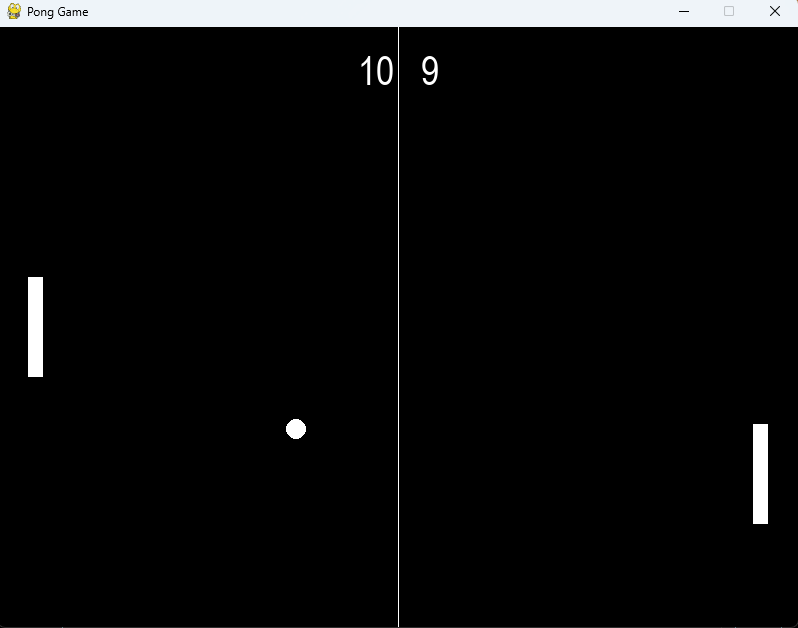

# 🏓 Pong Game

A classic **2-player Pong Game** developed using **Python** and **Pygame**. Players control paddles to hit the ball back and forth, earning points when the opponent misses. The game features smooth controls, collision detection, score tracking, and continuous gameplay.

---

## 📌 Features

- 🎮 Two-player gameplay
- ⌨️ Keyboard controls
- ⚡ Smooth paddle movement
- 💥 Ball collision with paddles and walls
- 📊 Real-time score tracking
- 🔄 Ball reset after each point
- 🎯 Randomized ball direction after scoring
- 🖥️ 60 FPS gameplay

---

## 🛠️ Tech Stack

- Python 3.x
- Pygame

---

# 🚀 Setup Guide

## 1. Clone the Repository

```bash
git clone https://github.com/your-username/pong-game.git
```

## 2. Navigate to the Project Folder

```bash
cd pong-game
```

## 3. (Optional) Create a Virtual Environment

### Windows

```bash
python -m venv venv
venv\Scripts\activate
```

### macOS/Linux

```bash
python3 -m venv venv
source venv/bin/activate
```

---

## 4. Install Dependencies

```bash
pip install pygame
```

or

```bash
pip install -r requirements.txt
```

---

## 5. Run the Game

```bash
python main.py
```

The game window will open automatically.

---

# 🎮 Controls

| Player | Controls |
|---------|----------|
| Left Player | **W** (Up), **S** (Down) |
| Right Player | **↑** (Up), **↓** (Down) |

---

# 🕹️ Gameplay

- The ball starts from the center.
- Hit the ball using your paddle.
- If the opponent misses the ball, you score a point.
- After each point, the ball resets to the center with a random direction.
- Keep playing and compete for the highest score.

---

# 📂 Project Structure

```
pong-game/
│
├── main.py
├── README.md
└── requirements.txt
```

---


## 📸 Screenshot




# 💡 Future Improvements

- Single-player mode with AI
- Pause and resume
- Sound effects
- Background music
- Winning screen
- Difficulty levels
- Ball speed increases over time
- Mobile support

---

# 👨‍💻 Author

**Madhumithra Srinivasan**

B.Tech CSE, NIT Tiruchirappalli

